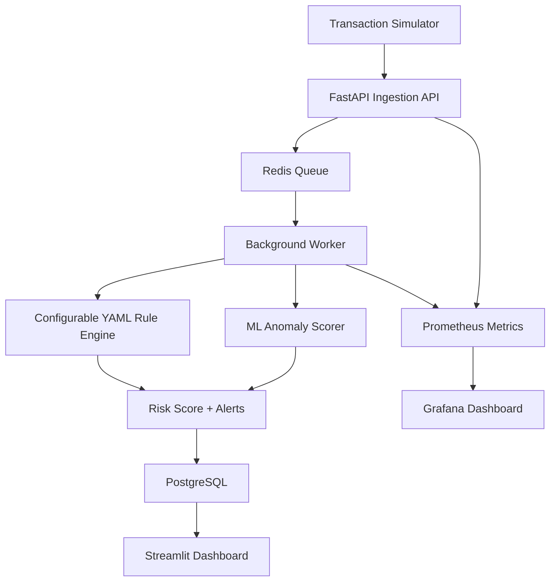

# Real-Time Fraud Detection and Transaction Monitoring Platform

A local, zero-cost fraud monitoring platform that ingests financial transactions, processes them asynchronously, applies configurable anomaly rules, runs ML-based anomaly scoring, stores alerts in PostgreSQL, and visualizes results through Streamlit, Prometheus, and Grafana.

---

## What This Project Does

This project simulates a real-time transaction monitoring system used to detect suspicious financial activity.

It can:

* Accept transaction events through a FastAPI API
* Queue transactions using Redis
* Process transactions in the background using a Python worker
* Apply 20+ configurable fraud and anomaly rules
* Use Isolation Forest for ML-based anomaly detection
* Store transactions, alerts, and matched rules in PostgreSQL
* Display monitoring insights in Streamlit
* Expose Prometheus metrics
* Visualize system metrics in Grafana

---

## Architecture



---

## Tech Stack

| Area             | Technology                    |
| ---------------- | ----------------------------- |
| Backend API      | FastAPI, Python               |
| Queue            | Redis                         |
| Worker           | Python Background Worker      |
| Database         | PostgreSQL                    |
| ORM              | SQLAlchemy                    |
| Rule Config      | YAML                          |
| ML               | Scikit-learn Isolation Forest |
| Dashboard        | Streamlit                     |
| Metrics          | Prometheus                    |
| Observability    | Grafana                       |
| Containerization | Docker, Docker Compose        |
| Testing          | Pytest                        |
| CI               | GitHub Actions                |

---

## Project Structure

```text
real-time-transaction-monitor/
├── api/                  # FastAPI transaction ingestion service
├── app/                  # Core logic, rules, ML, metrics
├── configs/              # YAML fraud rule configuration
├── db/                   # Database models and persistence logic
├── worker/               # Background transaction processor
├── simulator/            # Sample transaction generator/sender
├── monitoring/           # Prometheus and Grafana configs
├── tests/                # Automated tests
├── docker-compose.yml
└── README.md
```

---

## Setup

### 1. Clone the repository

```bash
git clone https://github.com/Anveshvarmad/real-time-transaction-monitor.git
cd real-time-transaction-monitor
```

### 2. Start all services

```bash
docker compose up --build
```

This starts all services locally.

| Service             | URL                        |
| ------------------- | -------------------------- |
| FastAPI Docs        | http://localhost:8000/docs |
| Streamlit Dashboard | http://localhost:8501      |
| Prometheus          | http://localhost:9090      |
| Grafana             | http://localhost:3000      |

Grafana login:

```text
username: admin
password: admin
```

---

## Send Sample Transactions

Open a second terminal:

```bash
python -m venv .venv
source .venv/bin/activate
pip install -r requirements.txt

python -m simulator.send_transactions --count 500 --batch-size 25
```

Then refresh:

```text
http://localhost:8501
http://localhost:3000
```

---

## Run Tests

```bash
pytest -v
```

Or run the local CI helper:

```bash
./scripts/run_ci_checks.sh
```

---

## Configurable Fraud Rules

Fraud rules are stored in:

```text
configs/rules.yaml
```

Example rule:

```yaml
HIGH_AMOUNT:
  enabled: true
  description: Transaction amount is above configured high amount threshold.
  risk_points: 30
  category: amount
  params:
    threshold: 5000
```

Rules can be enabled, disabled, or tuned without changing Python code.


---

## Useful Commands

Start services:

```bash
docker compose up --build
```

Stop services:

```bash
docker compose down
```

Send sample transactions:

```bash
python -m simulator.send_transactions --count 500 --batch-size 25
```

Check PostgreSQL:

```bash
docker exec -it transaction-postgres psql -U monitor -d transaction_monitor
```

Inside PostgreSQL:

```sql
SELECT COUNT(*) FROM transactions;
SELECT COUNT(*) FROM alerts;
SELECT COUNT(*) FROM rule_matches;
\q
```

Check Prometheus metrics:

```bash
curl http://localhost:8000/metrics
curl http://localhost:9100/metrics
```

